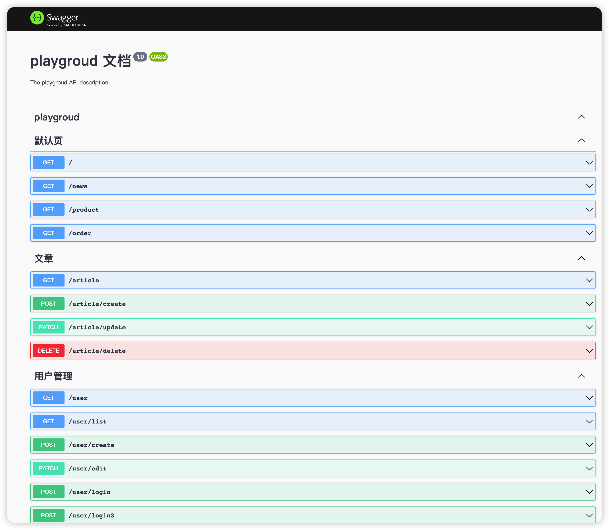
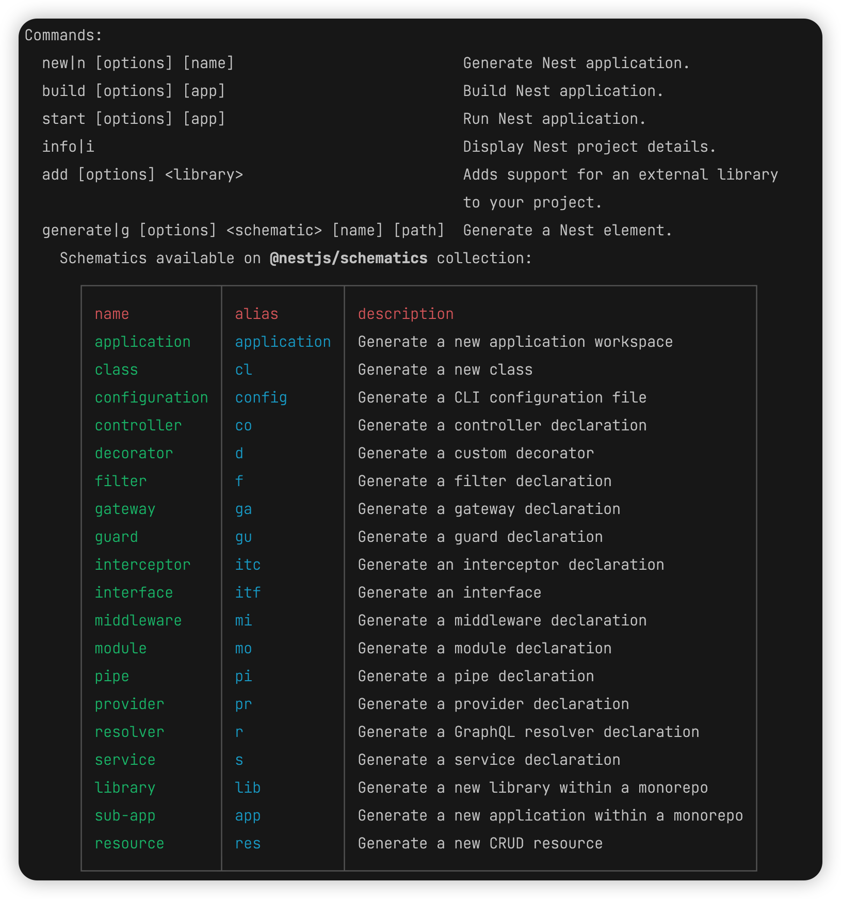

## nestdemo(playround)

- node 版本：`v18.12.1`
- NestJS 版本：`v9.0.0`

## 主要内容

- [x] `NestJS` 控制器，路由
- [x] `NestJS` 视图，模板引擎
- [x] `NestJS` 服务（Model）
- [x] `NestJS` `Cookie` 与 `Session`
- [x] `NestJS` 上传文件单个文件与多个文件
- [x] `NestJS` 中间件（`middleware`）
- [x] `NestJS` 管道（`pipe`）
- [x] `NestJS` 模块（模块，服务，控制器）
- [x] `NestJS` 守卫 (`guard`)
- [x] `NestJS` 拦截器 (`interceptors`)
- [x] `NestJS` `mongoose` 操作 `mongodb`
- [x] `NestJS` `TypeORM` 操作 `mysql`
- [x] `NestJS` 集成`swagger` 文档 （http://localhost:3000/api）

## swagger



## 命令行



## 项目运行

```bash
# development
$ npm run start

# watch mode
$ npm run start:dev

# production mode
$ npm run start:prod
```

## 参考资料

- [官方网站](https://nestjs.com/)
- [NestJS 文档](https://docs.nestjs.com/)
- [NestJS 中文文档](https://docs.nestjs.cn/)
- [Nestjs_Nestjs 实战教程](https://www.bilibili.com/video/BV1124y1k7th/?spm_id_from=333.999.0.0&vd_source=c5abf1ba032ca00c06ebba96e3ff445e)
- [Nestjs 全家桶系列](https://www.bilibili.com/video/BV1NG41187Bs?p=26&vd_source=c5abf1ba032ca00c06ebba96e3ff445e)
- [nestjs 从入门到实战--sequelize、typeorm、graphql、swagger](https://www.bilibili.com/video/BV1x341177P8/?spm_id_from=333.337.search-card.all.click&vd_source=c5abf1ba032ca00c06ebba96e3ff445e)
- [NestJS 官方基础课程](https://www.bilibili.com/video/BV1T44y1W7Si/?spm_id_from=333.337.search-card.all.click&vd_source=c5abf1ba032ca00c06ebba96e3ff445e)
